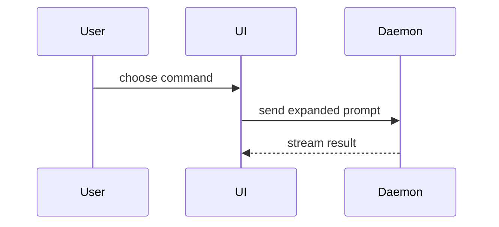

# Choosing a visual

Prose is the worst way to show structure. Pick the smallest view that makes the point, place it next
to the short text it supports, and keep only the calls, files, props, states, and boundaries the
reader needs — a sketch, never a pre-implementation. Code blocks declare their language.

## Logic or an algorithm — pseudocode

```text
on(save)
  if content is unchanged
    return cached result
  write new content
  return fresh result
```

## Runtime control flow — call tree

```text
submitForm
  createSession
    persistPrompt
    launchAgent
  navigateToSession
```

## UI structure — component tree

Annotate with paths, and include the state and module boundaries that matter.

```tsx
<SessionPage> (apps/example/src/routes/session.tsx)
  useSessionEvents()
  <SessionToolbar>
    <RunSkillButton> (packages/ui)
```

## File responsibility or a broad refactor — shallow file tree

```text
src/
├── commands/       # parses user actions
├── sessions/       # owns session state
└── transport/      # sends API requests
```

## Component interaction, sequences, data flow — Mermaid



## What changes when the shape already exists — `diff`

Match the diff's shape to the topic.

A component change:

```diff
 <SessionPage>
   useSessionEvents()
   <SessionToolbar>
+    <RunSkillButton />
   <SessionTimeline>
+    <SkillResultCard />
```

A file-layout change:

```diff
 src/
 ├── commands/
+│   └── show-me.ts       # expands the slash command
 ├── sessions/
-└── transport.ts
+└── transport/
+    ├── client.ts
+    └── stream.ts
```

A call-tree change:

```diff
 submitForm
   createSession
     persistPrompt
+    expandSkillMention
     launchAgent
-  navigateToSession
+  navigateToSession
+    subscribeToEvents
```

A state or control-flow change:

```diff
 on(save)
-  write content
+  if content is unchanged
+    return cached result
+  write new content
+  invalidate cache
```

## A mostly-new contract — full code block

Show the whole block when most of it is new, when omitted context would hide ownership or order, or
when the reader needs a copyable target shape.

```ts
function expandSkill(command: string): string {
  const skillName = command.slice(1);
  return `use the ${skillName} skill`;
}
```

## A dense UI, layout, or state comparison — HTML artifact

Too dense for Mermaid: write one focused HTML file next to the document it supports — a diagram, an
infographic, or a short slide deck, whichever fits. Match the product's colors, type, spacing, and
components; use real labels and data; support desktop and mobile. Then open it:

```
open <path>.html
```

## Guidance

Use one of these, sometimes several, rarely all. Each visual answers the question in front of it or
frames the options for the decision at hand — anything past that overwhelms the reader.
